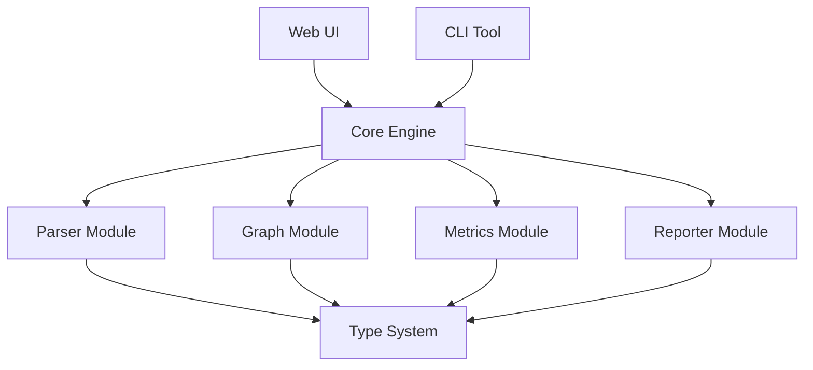
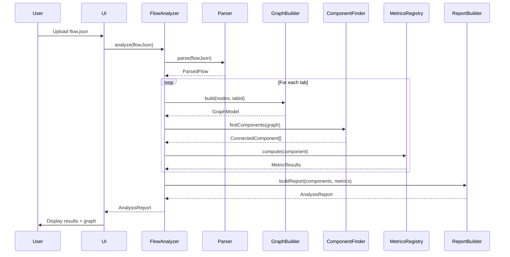

# Architecture Documentation

## Overview

DataFlow Graph Metrics is a static analysis tool for Node-RED flows. It analyzes dataflow graphs and computes software quality metrics using a modular pipeline architecture.

## System Architecture

## Module Structure

### Core Modules

#### 1. Parser Module
**Responsibility**: Parse and validate Node-RED JSON flows

**Components**:
- `FlowParser`: Main parser class
- `NodeClassifier`: Classifies nodes as decision/regular nodes
- Validation utilities

**Key Types**:
- `ParsedFlow`: Validated flow structure
- `NodeRedNode`: Individual node representation
- `NodeRedTab`: Flow tab/sheet

#### 2. Graph Module
**Responsibility**: Construct and analyze graph structures

**Components**:
- `GraphModel`: Directed graph implementation
- `GraphBuilder`: Constructs graphs from parsed nodes
- `ComponentFinder`: Identifies connected components using DFS

**Key Types**:
- `Graph`: Graph interface with node/edge operations
- `GraphNode`: Vertex in the graph
- `GraphEdge`: Directed edge between vertices
- `ConnectedComponent`: Isolated subgraph

#### 3. Metrics Module
**Responsibility**: Calculate quality metrics

**Components**:
- `MetricsRegistry`: Manages and executes metrics
- Size metrics: `VertexCountMetric`, `EdgeCountMetric`
- Structural metrics: `FanInMetric`, `FanOutMetric`, `DensityMetric`
- Complexity metrics: `CyclomaticComplexityMetric`, `NPathComplexityMetric`

**Key Types**:
- `IMetric`: Metric interface
- `MetricResult`: Metric computation result
- `MetricCategory`: 'size' | 'structural' | 'complexity'

#### 4. Reporter Module
**Responsibility**: Generate analysis reports

**Components**:
- `ReportBuilder`: Constructs structured reports

**Key Types**:
- `AnalysisReport`: Complete analysis output
- `ComponentReport`: Per-component metrics and graph data
- `ReportSummary`: High-level statistics

### UI Module

**Responsibility**: Web-based visualization and interaction

**Components**:
- `GraphView`: Cytoscape.js visualization wrapper
- `graphMapper`: Maps report data to Cytoscape elements
- `main.ts`: UI entry point and event handling

## Data Flow

## Design Patterns

### 1. Strategy Pattern
Metrics are implemented as individual strategies conforming to `IMetric` interface, allowing flexible addition of new metrics.

### 2. Builder Pattern
`ReportBuilder` constructs complex `AnalysisReport` objects step by step.

### 3. Registry Pattern
`MetricsRegistry` manages a collection of metrics and provides a unified interface for computation.

### 4. Immutability
All data structures use TypeScript's `Readonly<>` and `ReadonlyArray<>` to ensure immutability and prevent side effects.

## Key Design Decisions

### Deep Immutability
All core data structures are deeply immutable using TypeScript readonly modifiers. This ensures:
- No unexpected side effects
- Safe concurrent processing
- Predictable behavior

### Type vs Interface
- `type` for data structures (ParsedFlow, GraphNode, MetricResult)
- `interface` for behavioral contracts (IMetric, Graph)

### Graph Abstraction
The `Graph` interface abstracts graph operations, allowing different implementations. Currently using `GraphModel` with adjacency lists.

### Separation of Concerns
Clear boundaries between parsing, graph construction, metrics calculation, and reporting. Each module has a single responsibility.

### Error Handling
Validation errors are thrown early during parsing. The system fails fast with descriptive error messages.

## Testing Strategy

### Unit Tests
- Each metric has dedicated unit tests
- Graph operations are tested independently
- Parser validation is thoroughly tested

### Integration Tests
- Multiple components working together within modules
- Parser + GraphBuilder integration
- MetricsRegistry with all metrics

### End-to-End Tests
- Full public API testing through `analyzeFlow()`
- Complete flow analysis from JSON input to report output
- Multi-component flows and complex graph structures

### Test Coverage
- 220+ tests across all levels
- All critical paths covered
- Edge cases validated

## Performance Considerations

- **Graph Construction**: O(V + E) time complexity
- **Component Finding**: O(V + E) using DFS
- **Metrics Calculation**: Varies by metric, most O(V + E)
- **Overall**: Linear scaling with flow size

## Future Extensibility

### Adding New Metrics
1. Implement `IMetric` interface
2. Add to appropriate category folder
3. Register in `MetricsRegistry`
4. Add unit tests

### Adding New Node Types
1. Update `NodeClassifier` decision logic
2. Add new type to type definitions
3. Update graph builder if needed

### Adding Export Formats
1. Create new builder in reporter module
2. Implement format-specific transformation
3. Add to export options
