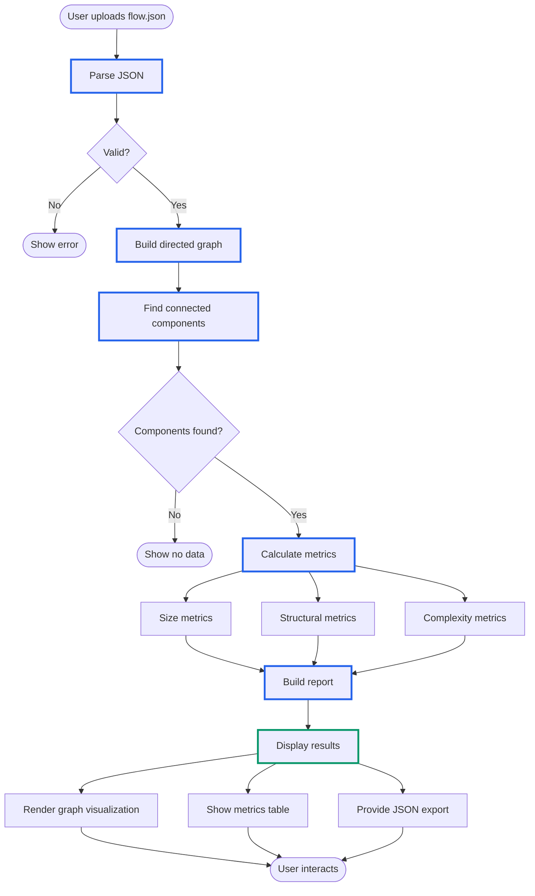

# System Diagrams

## Package Diagram

Shows the main packages and their dependencies.

## Component Diagram

Shows the main components and their relationships.

## Class Diagram - Core Components

## Data Flow Diagram

## Metrics Categories

## Testing Pyramid

